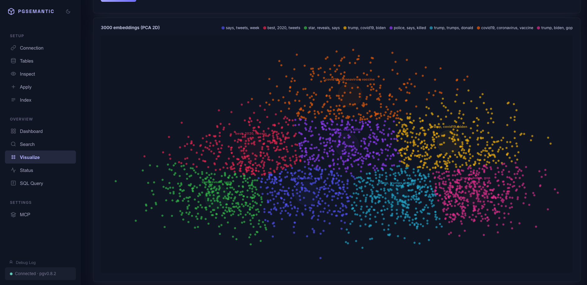
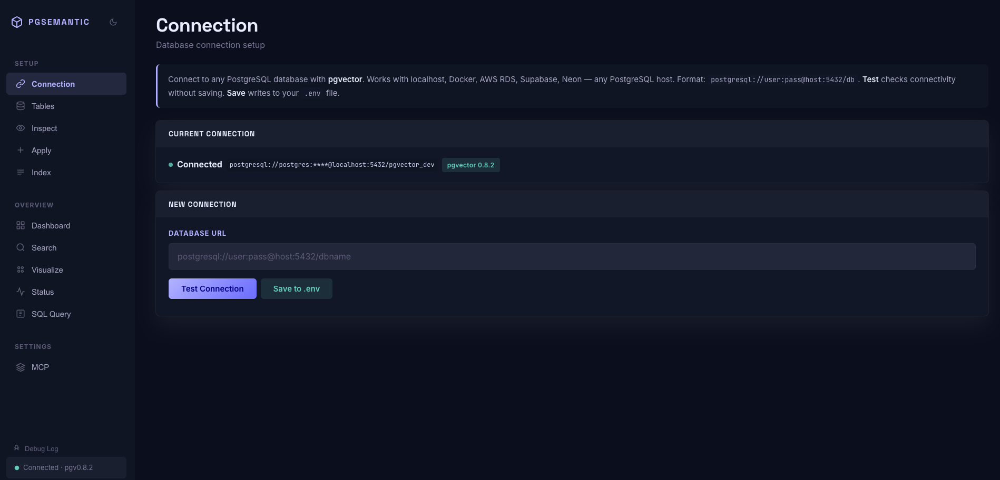
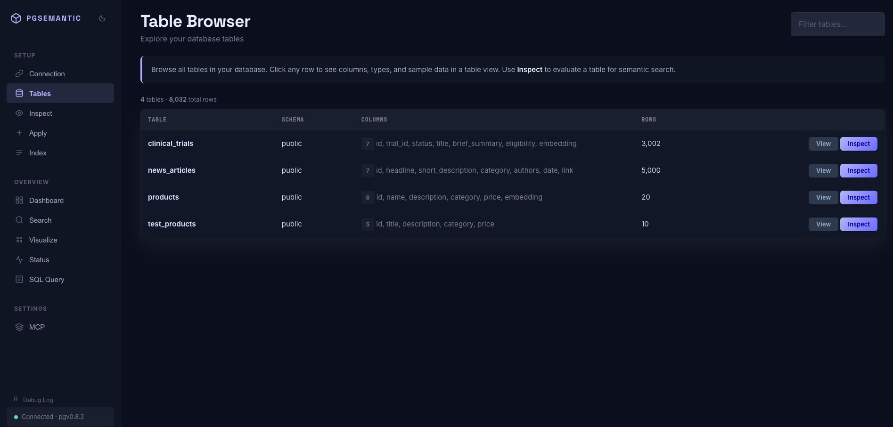
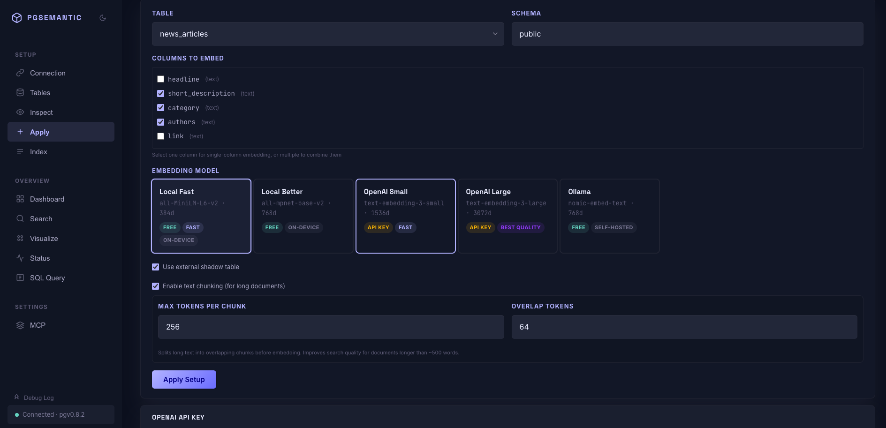
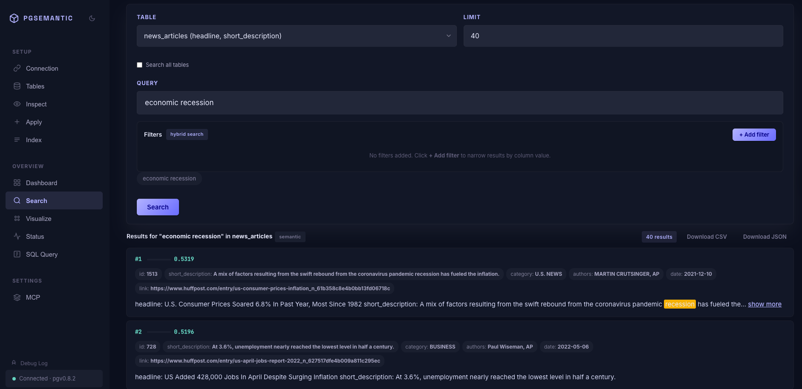
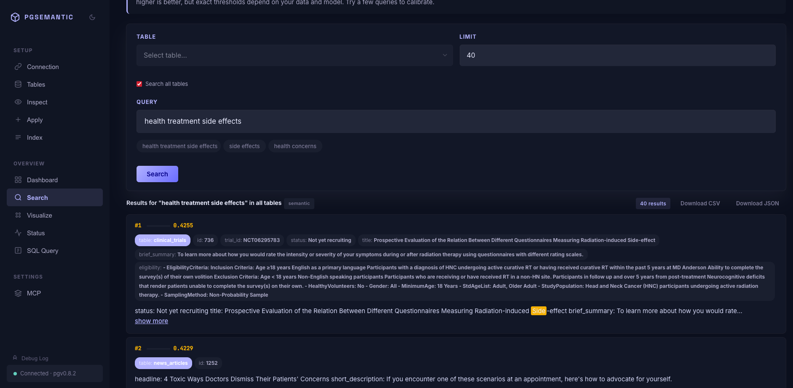
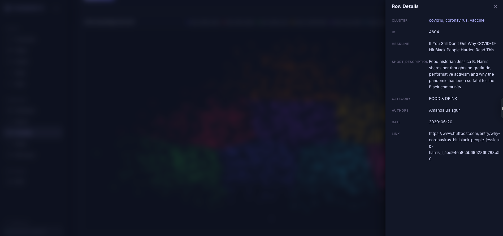
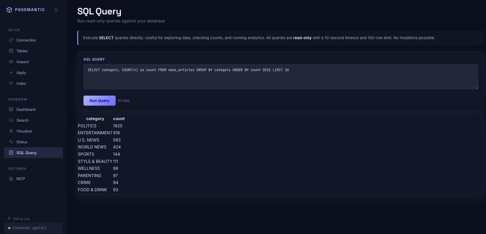
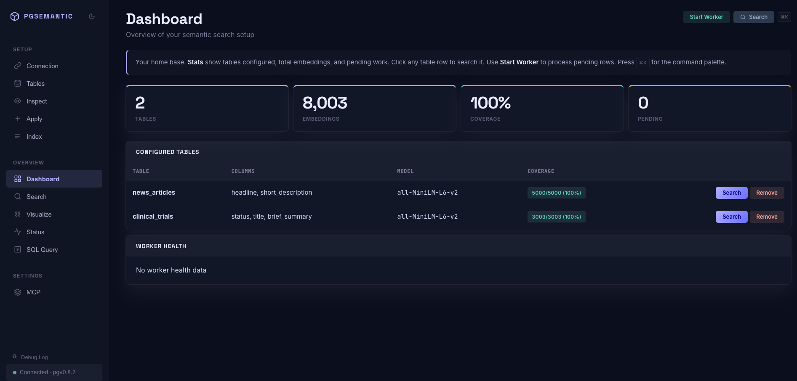
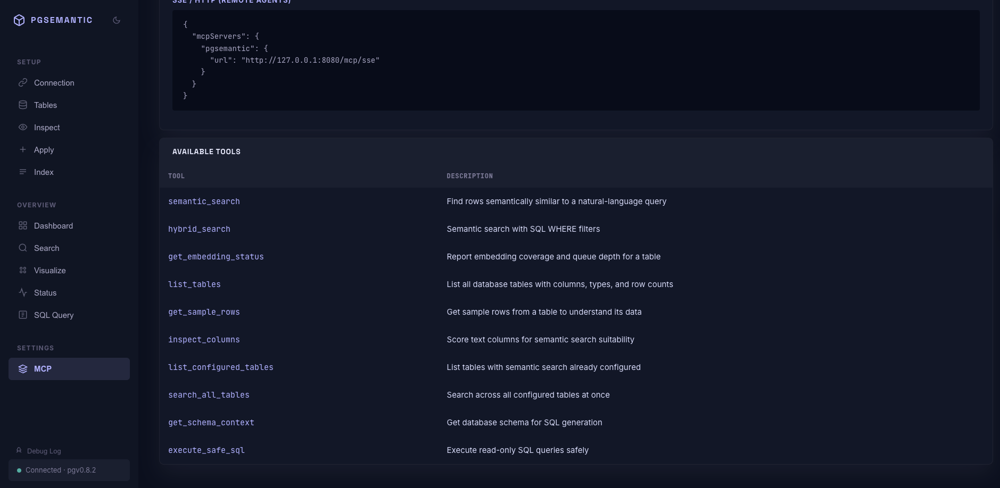

# pgsemantic

**Turn any PostgreSQL database into a semantic search engine. Set up in 60 seconds. No migrations, no new infrastructure.**

[](https://pypi.org/project/pgsemantic/)
[](https://www.python.org/downloads/)
[](LICENSE)
[]()

pgsemantic connects to your existing PostgreSQL database, picks up your text columns, and makes them searchable by meaning. No data migration, no vector database, no pgvector expertise. It works on your live tables and keeps everything in sync automatically.



*3,000 news articles visualized by semantic similarity. Each dot is a row in the database. Colors are auto-detected topic clusters. This is what your data looks like when you can search it by meaning.*

---

## What makes this different

Most vector search tools ask you to set up a separate vector database, write ETL pipelines, and maintain sync logic. pgsemantic works directly on your existing PostgreSQL tables:

- **No new database** — embeddings live alongside your data (inline column or shadow table)
- **No ETL** — a database trigger keeps embeddings in sync as rows change
- **No expertise needed** — point it at a table, pick a column, done
- **Free by default** — runs a local embedding model on your machine (no API keys)

---

## See it in action

### Connect to any PostgreSQL database



*Paste your connection string, test it, done. Works with localhost, Supabase, Neon, RDS — anything with pgvector.*

### Browse and explore your tables



*See every table, column types, and row counts. Click Inspect to score columns for semantic search suitability.*

### Set up with chunking for long documents



*Pick columns, choose a model, enable chunking for long text. Chunking splits documents into overlapping paragraphs so search finds the best paragraph, not just the best document.*

### Search by meaning, not keywords



*Query: "economic recession" — returns articles about inflation, unemployment, consumer prices. These results share the concept, not the exact words.*

### Search across all your tables at once



*"health treatment side effects" across clinical_trials and news_articles. Results ranked by similarity regardless of source table. Purple badges show where each result came from.*

### See how your data clusters


*3,000 embeddings reduced to 2D with PCA. K-means clustering auto-labels each group with its top keywords. Click any point to see the full row.*



### Run SQL queries directly



*Built-in SQL query tool. Read-only, 10-second timeout, 100-row limit. Safe to explore.*

### Monitor everything from one dashboard



*Coverage, pending queue, worker health — all in one view.*

### 10 MCP tools for AI agents



*Connect Claude Desktop, Cursor, or any MCP-compatible AI agent. They can search semantically, run SQL queries, and explore your schema.*

---

## Quick start

```bash
pip install pgsemantic

# Launch the web UI
pgsemantic ui

# Or use the CLI
pgsemantic inspect   # Scan your DB, score columns
pgsemantic apply --table articles --column body   # Set up semantic search
pgsemantic index --table articles                  # Embed existing rows
pgsemantic search "climate policy effects"         # Search by meaning
```

Open [http://localhost:8080](http://localhost:8080) and walk through setup visually:

1. **Connection** — paste your PostgreSQL URL
2. **Tables** — browse your database
3. **Apply** — pick columns, choose a model, one click
4. **Index** — embed all rows (progress bar, resumable)
5. **Search** — natural language queries, instantly

---

## Features

### Core

| Feature | Description |
|---------|-------------|
| **Semantic search** | Search by meaning, not keywords. "budget travel" finds "affordable hostels" |
| **Cross-table search** | Search all configured tables at once — results merged by similarity |
| **Auto-chunking** | Split long documents into overlapping chunks for precise paragraph-level search |
| **Hybrid search** | Combine semantic similarity with SQL WHERE filters in one query |
| **Multi-column embedding** | Embed title + description + tags as one combined vector |
| **Automatic sync** | Database triggers keep embeddings fresh on every INSERT/UPDATE/DELETE |

### Operations

| Feature | Description |
|---------|-------------|
| **Zero-downtime model migration** | Switch embedding models without breaking search — atomic swap |
| **Pipelined indexing** | Embeds batch N+1 while writing batch N — ~2x throughput |
| **Background worker** | Daemon process for continuous embedding sync with retry logic |
| **Shadow table storage** | Store embeddings separately without modifying your source table |

### Visualization & Analytics

| Feature | Description |
|---------|-------------|
| **Embedding scatter plot** | 2D PCA visualization with auto-detected clusters and keyword labels |
| **SQL query tool** | Run read-only queries from the UI (10s timeout, 100-row limit) |
| **Status dashboard** | Coverage %, pending queue, failed jobs, worker health — all in one view |

### AI Agent Integration (MCP)

10 tools for Claude Desktop, Cursor, and any MCP-compatible agent:

| Tool | What it does |
|------|-------------|
| `semantic_search` | Find rows by meaning |
| `hybrid_search` | Semantic + SQL filters |
| `search_all_tables` | Cross-table search |
| `get_schema_context` | Table schemas for SQL generation |
| `execute_safe_sql` | Run read-only SQL queries safely |
| `get_embedding_status` | Check embedding coverage |
| `list_tables` | Browse all tables |
| `get_sample_rows` | Preview table data |
| `inspect_columns` | Score columns for search suitability |
| `list_configured_tables` | List configured tables |

---

## Embedding models

| Model | Dimensions | Cost | Best for |
|-------|-----------|------|---------|
| **Local Fast** (all-MiniLM-L6-v2) | 384 | Free | Getting started, most use cases |
| **Local Better** (all-mpnet-base-v2) | 768 | Free | Higher accuracy |
| **OpenAI Small** (text-embedding-3-small) | 1536 | ~$0.02/1M tokens | Production, multilingual |
| **OpenAI Large** (text-embedding-3-large) | 3072 | ~$0.13/1M tokens | Maximum accuracy |
| **Ollama** (nomic-embed-text) | 768 | Free | Self-hosted, privacy-sensitive |

Switch models anytime with zero-downtime migration:

```bash
pgsemantic migrate --table articles --model openai
```

---

## Works with any PostgreSQL

- Local PostgreSQL + pgvector
- **Supabase** (enable pgvector in Dashboard > Database > Extensions)
- **Neon**
- **Amazon RDS** / Aurora PostgreSQL
- **Google Cloud SQL** for PostgreSQL
- Any self-hosted PostgreSQL with pgvector

---

## Architecture

```
Your App ──────────────────────────────────────────────────┐
                                                           │
CLI (Typer) ─┐                                             │
Web UI (FastAPI) ─┤──> Embedding Providers ──> PostgreSQL + pgvector
MCP Server (FastMCP) ─┘   (local/openai/ollama)    │
                                                    ├── Source tables (your data)
Background Worker ──> Job Queue ────────────────────├── Shadow tables (embeddings)
                                                    └── HNSW indexes (fast search)
```

- **No external services** — everything runs locally (unless you choose OpenAI)
- **No build step** — the web UI is vanilla HTML/JS/CSS in a single file
- **No external dependencies in the frontend** — no React, no Tailwind, no CDN

---

## Security

- Database URL **never sent to the browser** — stays server-side only
- **CSRF protection** on all POST endpoints
- **SQL injection prevention** via Pydantic validation + regex on identifiers
- **Rate limiting** — 120 requests/minute per IP
- **Content Security Policy**, X-Frame-Options, and security headers on all responses
- SQL Query tool enforces **read-only transactions** with **10-second timeout**
- `.env` written with **chmod 600** — owner-read-only

---

## CLI reference

```bash
pgsemantic inspect          # Scan DB, score columns
pgsemantic apply            # Set up semantic search on a table
pgsemantic index            # Bulk embed existing rows
pgsemantic search "query"   # Search (omit --table to search all)
pgsemantic migrate          # Switch embedding models (zero downtime)
pgsemantic worker           # Background embedding sync daemon
pgsemantic serve            # MCP server for AI agents
pgsemantic status           # Health dashboard
pgsemantic ui               # Web dashboard
pgsemantic retry            # Reset failed embedding jobs
```

---

## Development

```bash
git clone https://github.com/varmabudharaju/pgvector-setup.git
cd pgvector-setup
pip install -e ".[dev]"
docker-compose up -d        # Postgres + pgvector
pytest tests/unit/ -v       # 144 tests, all passing
ruff check .                # Lint
```

---

## FAQ

**Does it work with tables that already have data?**
Yes. Run `index` to embed existing rows. New rows are handled automatically by the trigger.

**Which embedding model should I pick?**
Start with Local Fast — it's free and works offline. Switch to OpenAI for multilingual or higher accuracy.

**Can I search across multiple tables?**
Yes. `pgsemantic search "query"` (without `--table`) searches all configured tables at once.

**Can I change the model after indexing?**
Yes. `pgsemantic migrate --table T --model openai` re-embeds in the background with zero downtime.

**What about long documents?**
Use `--chunked` when applying. This splits text into overlapping chunks so search finds the best paragraph, not just the best document.

**Does it slow down my database?**
The trigger writes a small job record to a queue table. The actual embedding happens asynchronously in the background worker, not in your transaction.

**How do I connect AI agents?**
Add the MCP config snippet (shown on the MCP page in the UI) to your Claude Desktop or Cursor config. Agents get 10 tools including semantic search, SQL queries, and schema exploration.

---

## License

MIT
